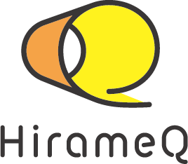

# ビジョン

各人が持つ才能やアイデアはとても素晴らしいが、なかなかリアルにそれを実現することはとても難しい。

そのままでは埋もれてしまうアイデアを実現させるために必要な支援を行い、共に未来にわくわくできるような楽しい世界を作る。

# ミッション

アイデアを実際に具現化できるように、プロフェッショナルとして様々な技術や手法を学び、そのアイデアを確実に実現させ、かつ元の予想を上回るような提案や支援をしていく。

# 会社情報

|項目|内容|
|---|---|
|会社名	|合同会社HirameQ（ひらめく）|
|資本金	|3,000,000円|
|設立	|2020年9月2日|
|所在地	|〒151-0053　東京都渋谷区代々木2-36-6|
|連絡先	|info at hirameq.jp もしくは contactページからどうぞ|
|事業内容|ハードウエアやモバイルアプリ、Webサイトなどの開発、製造、販売、運用 それらに付随する関連業務|

# 由来

わくわくするようなアイデアが「ひらめく」ような世界を作りたい。

そのアイデアを素早く（Quick）、質良く（Quality）実現に向けて、未来を拓く支援していくという目標を目指す社名として「HirameQ」と名付けました。
